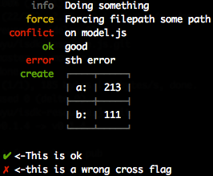

## terminal-logger [](https://npmjs.org/package/terminal-logger)

[](http://travis-ci.org/snowyu/terminal-logger.js)
[](https://codeclimate.com/github/snowyu/terminal-logger.js)
[](https://codeclimate.com/github/snowyu/terminal-logger.js/coverage)
[](https://npmjs.org/package/terminal-logger)
[](https://npmjs.org/package/terminal-logger)


Terminal-logger prints the message to the console.

All logs are done against STDERR, letting you stdout for meaningfull
value and redirection, should you need to generate output this way.

* Customize colorful status
* Single-line update
* table supports

## Usage

```js
logger  = require('./')('test')

logger
  .write()
  .info('Doing something')
  .force('Forcing filepath %s', 'some path')
  .conflict('on %s', 'model.js')
  .ok('good')
  .error('sth error')
  .create(logger.table([['a:', 213], ['b:', 111]]))
  .write()
  .tick('<-This is ok')
  .cross('<-this is a wrong cross flag')
```

the result:



Single-line update:

```coffee
log = require('terminal-logger/lib/single-line')('test')
dash = '>'
singleLineLog = ->
   dash = dash.replace('>', '->')
   log.info("update:", dash)
   dash = '>' if dash.length > 60
   setTimeout(singleLineLog, 500)
singleLineLog()
```

the result:


## API


## TODO


## License

MIT
