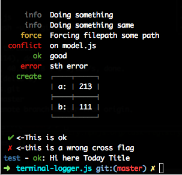

## terminal-logger [](https://npmjs.org/package/terminal-logger)

[](http://travis-ci.org/snowyu/terminal-logger.js)
[](https://codeclimate.com/github/snowyu/terminal-logger.js)
[](https://codeclimate.com/github/snowyu/terminal-logger.js/coverage)
[](https://npmjs.org/package/terminal-logger)
[](https://npmjs.org/package/terminal-logger)


Terminal-logger prints the message to the console.

All logs are done against STDERR, letting you stdout for meaningfull
value and redirection, should you need to generate output this way.

* Customize colorful status
* Single-line update
* table supports

## Usage

```js
logger  = require('./')('test')
//change the logging level.
logger.level = 'info'

logger
  .write()
  .status.info('Doing something')
  .status('info','Doing something same')
  .status.force('Forcing filepath %s', 'some path')
  .status.conflict('on %s', 'model.js')
  .status.ok('good')
  .status.error('sth error')
  .status.create(logger.table([['a:', 213], ['b:', 111]]))
  .write()
  .tick('<-This is ok')
  .cross('<-this is a wrong cross flag')

logger.log({
  message: '${name} - ${status}: Hi here ${title}'
  , title: 'Today Title'
  , status: 'ok'
})
```

the result:



Single-line update:

```coffee
log = require('terminal-logger/lib/single-line')('test')
log.level = 'info'
dash = '>'
singleLineLog = ->
   dash = dash.replace('>', '->')
   log.status("info", "update:", dash)
   dash = '>' if dash.length > 60
   setTimeout(singleLineLog, 500)
singleLineLog()
```

the result:


## API


## TODO

## Changes

### v0.2.0

+ add the logging level supports
- **broken**: remove the predefined status as its logging method utility
+ add `status(aStatus, aMessage, ...)` and `status[status](aMessage,...)` methods
+ add customizable colors and statusLevels
  + the default colors(map the status or level to color):
    * skip: 'magenta'
    * force: 'yellow'
    * create: 'green'
    * invoke: 'bold'
    * conflict: 'red'
    * identical: 'cyan'
    * ok: 'green'
    * emergency: ['red', 'bold']
    * alert: 'red'
    * critical: 'red'
    * error: 'red'
    * warning: 'yellow'
    * notice: 'gray'
    * info: 'gray'
    * debug: 'blue'
    * trace: 'blue'
    * '✔': 'green'
    * '✗': 'red'
    * name: 'blue'  # it's NOT the status, it's just the logger name's color.
  + the default statusLevels(map the status to logging level):
    * skip: 'warning'
    * force: 'warning'
    * create: 'notice'
    * invoke: 'notice'
    * conflict: 'error'
    * identical: 'error'
    * ok: 'notice'
    * '✔': 'notice'
    * '✗': 'error'

## License

MIT
